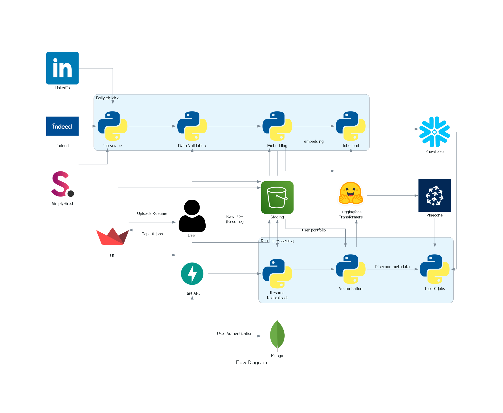

# JobMatch - Job Recommendation System 

## Live application links

[](https://codelabs-preview.appspot.com/?file_id=1xOJo6D40dsWjctPaj2Z7uZlOG9cHrW0DRejiGDkK9XM#0)

[](https://youtu.be/yw4AyXYgTtY)

## Technologies Used
[](https://streamlit.io/)
[](https://fastapi.tiangolo.com/)
[](https://aws.amazon.com/)
[](https://cloud.google.com)
[](https://github.com/)
[](https://www.python.org/)
[](https://pandas.pydata.org/)
[](https://numpy.org/)
[](https://openai.com/)
[](https://www.snowflake.com/)
[](https://huggingface.co/docs/transformers/en/model_doc/bert)
[](https://www.docker.com/)
[](https://airflow.apache.org/)
[](https://www.selenium.dev/)
[](https://plotly.com/)
[](https://www.mongodb.com/)
[](https://www.pinecone.io/)

## Overview

JobMatch is a revolutionary Job Recommendation System designed to streamline and enhance the job search experience by centralizing the job search process and by analyzing user uploaded resumes. JobMatch provides tailored job recommendations from top platforms like LinkedIn, Indeed, and SimplyHired. Users gain direct access to recommended job listings, ensuring a personalized and efficient job search experience.

## Problem Statement

### Challenge:
The current scenario for the job search process is really tiresome and exhilarating for job seekers. A user currently has to go through every job portal manually, browse through the available jobs, and make a profile describing the role he/she is targeting; which consumes a lot of time. We wanted to optimize the process by making an application that will bring jobs from different portals and filter them based on the user's resume, by using modern technologies, hence easing the process for job seekers.

### Solution:
The objective of this project is to develop and deploy an efficient data engineering infrastructure for a Job Recommendation System, termed "JobMatch," which facilitates the seamless matching of job seekers with relevant employment opportunities based on their uploaded resumes. Unlike traditional job search platforms, JobMatch will aggregate jobs from several portals, utilize advanced data processing techniques to analyze the content of user's resumes, and recommend suitable job openings from various sources such as LinkedIn, Indeed, and SimplyHired. The system will not only match job seekers with relevant positions but also provide direct access to the recommended job listings through provided links.

## Architecture:



## Codelab
Link: https://codelabs-preview.appspot.com/?file_id=1xOJo6D40dsWjctPaj2Z7uZlOG9cHrW0DRejiGDkK9XM#0

## Project Tree

```
📦 
├─ .gitignore
├─ README.md
├─ airflow
│  ├─ .gitignore
│  ├─ Dockerfile
│  ├─ configuration.properties.example
│  ├─ dags
│  │  ├─ embed
│  │  │  ├─ configuration.properties.example
│  │  │  ├─ connections.py
│  │  │  └─ embed_and_upsert.py
│  │  ├─ extract
│  │  │  ├─ configuration.properties.example
│  │  │  ├─ connections.py
│  │  │  ├─ extract_indeed_jobs.py
│  │  │  ├─ extract_linkedin_jobs.py
│  │  │  └─ extract_simplyhired_jobs.py
│  │  ├─ load
│  │  │  ├─ configuration.properties.example
│  │  │  ├─ connections.py
│  │  │  └─ loading.py
│  │  ├─ pipeline_indeed.py
│  │  ├─ pipeline_linkedin.py
│  │  ├─ pipeline_simplyhired.py
│  │  └─ validate
│  │     ├─ configuration.properties.example
│  │     ├─ connections.py
│  │     └─ validation.py
│  ├─ docker-compose.yaml
│  └─ requirements.txt
├─ architecture-diagram
│  ├─ flow_diagram.ipynb
│  ├─ flow_diagram.png
│  └─ input_icons
│     ├─ huggingface.png
│     ├─ indeed.png
│     ├─ linkedin.png
│     ├─ openai.png
│     ├─ pdf.png
│     ├─ pinecone.png
│     ├─ streamlit.png
│     ├─ user-authentication.png
│     └─ user.png
├─ cloudbuild.yaml
├─ docker-compose.yaml
├─ fastapi-backend
│  ├─ Dockerfile
│  ├─ configuration.properties.example
│  ├─ connections.py
│  ├─ main.py
│  ├─ requirements.txt
│  ├─ routes
│  │  ├─ analyticsRoute.py
│  │  ├─ authRoute.py
│  │  └─ userRoutes.py
│  └─ test_api.py
├─ requirements.txt
├─ setup
│  └─ snowflake_objects.sql
└─ streamlit-frontend
   ├─ Dockerfile
   ├─ components
   │  ├─ analytics.py
   │  ├─ get_job_matches.py
   │  ├─ login_page.py
   │  ├─ signup_page.py
   │  └─ upload_page.py
   ├─ configuration.properties.example
   ├─ main.py
   └─ requirements.txt
```
©generated by [Project Tree Generator](https://woochanleee.github.io/project-tree-generator)

## Prerequisites
Before running this project, ensure you have the following prerequisites set up:

- **Python**: Ensure Python is installed on your system.
- **Docker**: Ensure Docker-desktop is installed on your system.
- **Virtual Environment**: Set up a virtual environment to manage dependencies and isolate your project's environment from other Python projects. You can create a virtual environment using `virtualenv` or `venv`.
- **requirements.txt**: Install the required Python dependencies by running the command:
  ```
  pip install -r requirements.txt
  ```
- **Config File**: Set up the `configurations.properties` file with the necessary credentials and configurations.

- **Snowflake**: Use `setup/snowflake_objects.sql` to define the queries on snowflake. Also, ensure you have the necessary credentials and configurations set up in the `configurations.properties` file for connecting to Snowflake.
- **Google Cloud Platform**: Create a Google Cloud Engine. Ensure you have the necessary credentials and configurations set up in the `configurations.properties` file.

## How to Run the Application Locally

To run the application locally, follow these steps:

1. Clone the repository to get all the source code on your machine.

2. Use `source/venv/bin/activate` to activate the environment.

3. Create a configuration.properties file in the all the directories where configuration.properties.example is present. Sample config file:

```
[auth-api]
SECRET_KEY = 
ALGORITHM = 

[MongoDB]
mongo_url = 
db_name = 
collection_name = 
collection_name_markdown = 

[airflow]
base_url_airflow = 
password = 
username = 

[AWS]
access_key = 
secret_key = 
region_name = 

[s3-bucket]
bucket = 
resumes_folder_name = 
text_folder_name = 

[SNOWFLAKE]
user = 
password = 
account = 
warehouse = 
database = 
schema = 
role = 
jobsTable = 

[OPENAI]
api_key = 

[PINECONE]
pinecone_api_key = 
index = 
```

4. Once you have set up your environment variables, Use `docker-compose up - build` to run the application

5. Access the Airflow UI by navigating to http://localhost:8080/ in your web browser.

6. Once the DAGs have run successfully, view the Streamlit application

7. Access the Streamlit UI by navigating to http://localhost:8501/ in your web browser.

8. Enter username and password if you've already logged in. Otherwise you can register yourself and then run the application.
